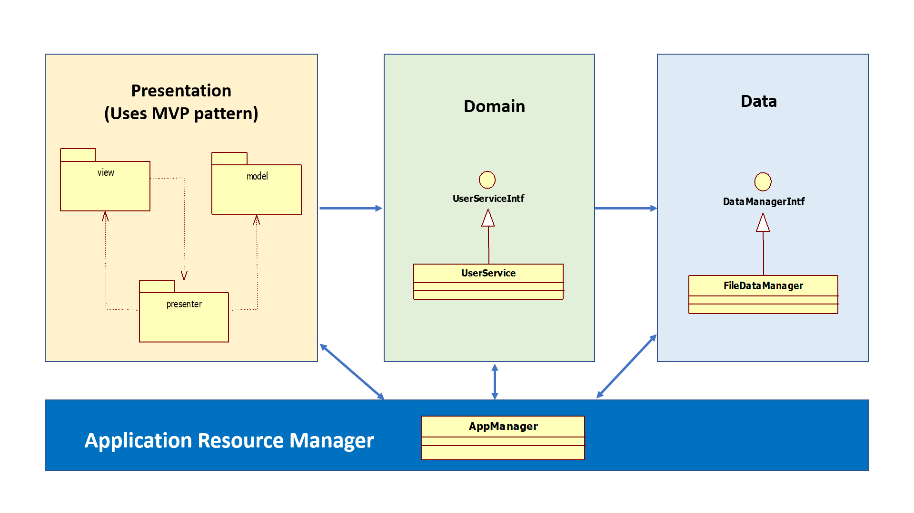
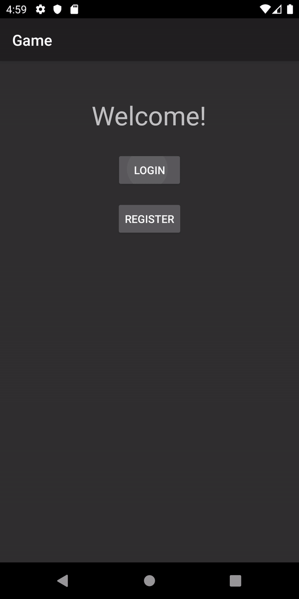
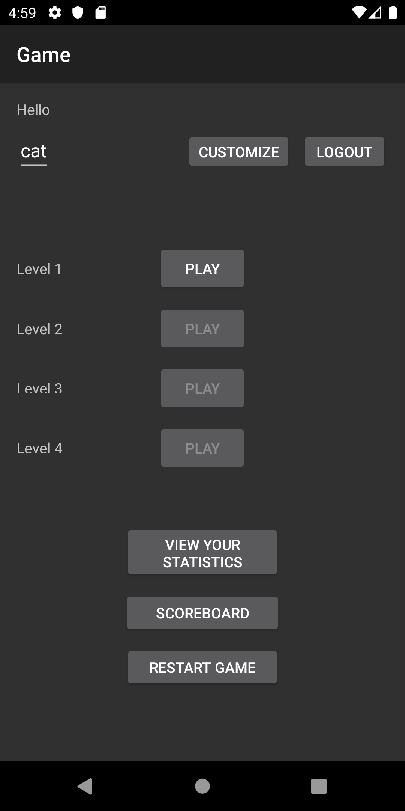
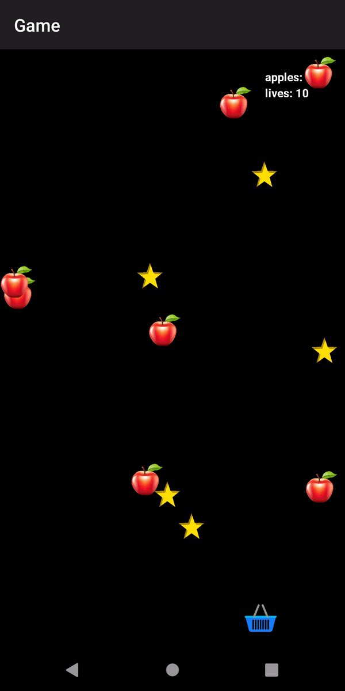
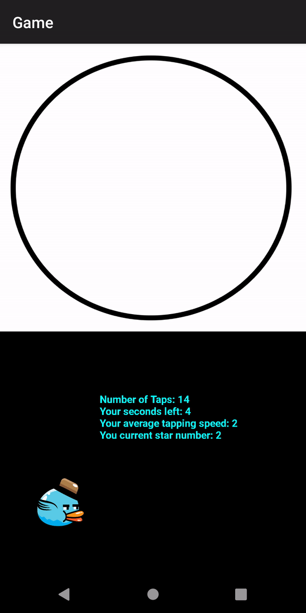
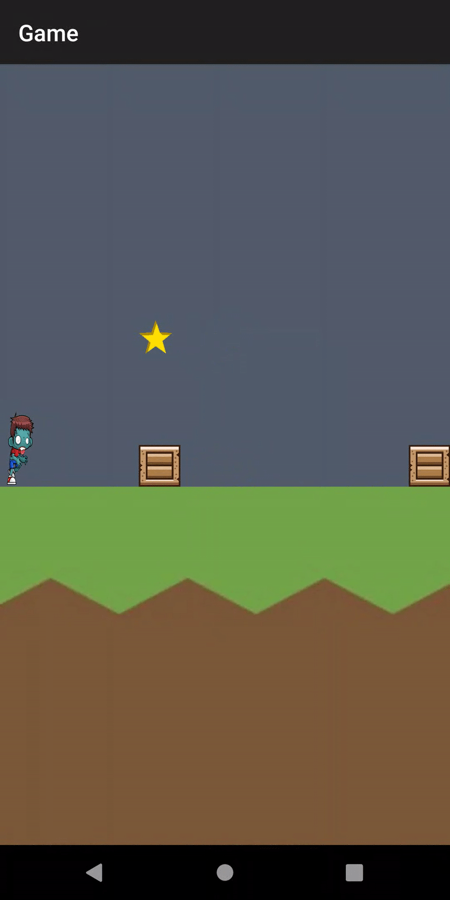
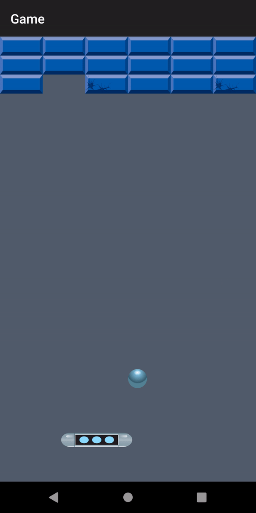
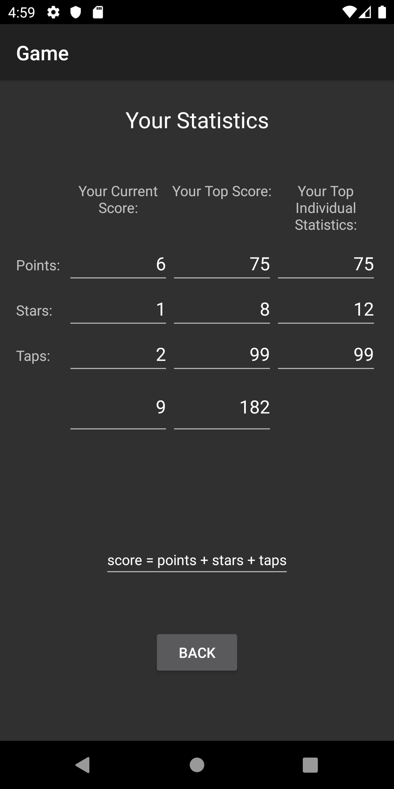
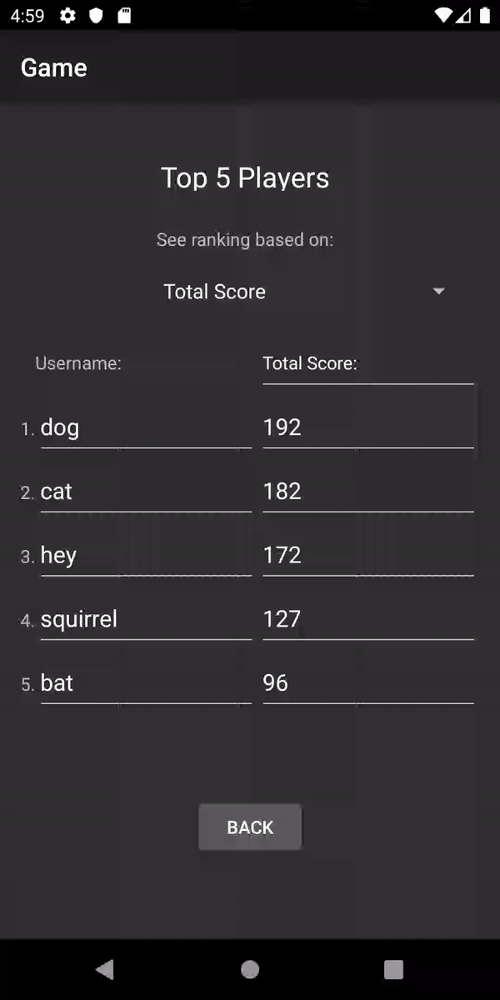

# Android-Game

<h3>About the Project<h3/>
  
This android app is a collaboration project with three of my peers.

This app allows users to register, login, and logout. 
When logged in, the user can play through 4 mini-games, 
view their current and past game statistics, 
and compare their statistics with other users. 

<h3>Goal of the Project<h3/>

The goal of this project is to use design principles, 
design patterns, and packaging to make code that is clean and extensible.

This project follows Clean Architecture and MVC (Model, View,
Controller) for packaging. 

Design patterns used in this project include 
Dependency Inversion, Singleton, Observer, 
Builder, Factory, and Strategy. 

 

<h3>High Level Architecture Diagram of the Project:<h3/>

 

 

<h3>Previews of the Project:<h3/>

<h5>Login:<h5/>

<h5>User Menu:<h5/>

<h5>Level 1: Apple Catching Game:<h5/>

<h5>Level 2: Speed Tapping Game:<h5/>

<h5>Level 3: Jumping Game:<h5/>

<h5>Level 4: Brick Breaker Game:<h5/>

<h5>User Statistics:<h5/>

<h5>Scoreboard:<h5/>

